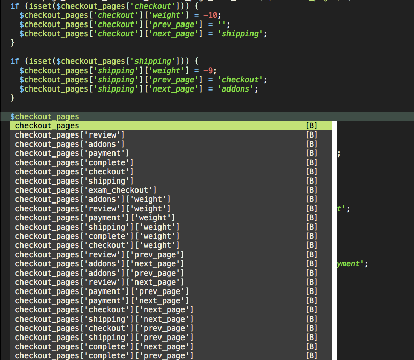

# neocomplete-array-multi
Neocomplete filters that allow to complete multi-dimensional PHP arrays from a variable name.

E.x:

```php
$checkout_pages['shipping']['weight'] = -9;
$checkout_pages['shipping']['prev_page'] = 'checkout';
$checkout_pages['shipping']['next_page'] = 'addons';
```

When the variable name is typed $checkout_pages will suggest for autocompletion the associative keys of the array on the autocomplete popup.

Note that in order to properly work you will need to tweak the neocomplete keywork patterns to:

```vim
let g:neocomplete#keyword_patterns['php'] = '\h[0-9A-Za-z_\-]*\%\([\[\{][0-9A-Za-z_''"\-\$/% ]*[\]\}]\)*'
```
## Screen Shot

